# Unit 20 - "Looks like we've made our first contract!"

## Background

Your new startup has created its own Ethereum-compatible blockchain to help connect financial institutions, and the team wants to build smart contracts to automate some company finances to make everyone's lives easier, increase transparency, and to make accounting and auditing practically automatic.

This assignment  creates 3 `ProfitSplitter` contracts. These contracts will do several things:

* Pay your associate-level employees quickly and easily.

* Distribute profits to different tiers of employees.

* Distribute company shares for employees in a "deferred equity incentive plan" automatically.

Below describes each contract and how to run it
## Prerequisities
Ensure you have the following:
1. Ganache running and a ethereum network running. [Ganache Software](https://www.trufflesuite.com/ganache)
2. Metamask wallet connected to the network (Testnet or Local depending on where you want to connect )[Metamask Wallet](https://metamask.io/)
3. Sufficient funds in your account to cover the amount you want to send as well as the Gas fees.
4. [Remix IDE](http://remix.ethereum.org/) 
5. Connection to a testnet if you want to deploy on a public testnet

Contracts files are to be uploaded to remix from [Contracts](./contracts). The contracts are as follows:
## Files

* [`AssociateProfitSplitter.sol`](contracts/AssociateProfitSplitter.sol) — Level 1 starter code.

* [`TieredProfitSplitter.sol`](contracts/TieredProfitSplitter.sol) — Level 2 starter code.

* [`DeferredEquityPlan.sol`](contracts/DeferredEquityPlan.sol) — Level 3 starter code.

 To execute these:
 1. Open the contract in remix ide:
 2. Compile the contract:
    * Enter the three public addresses of the each of the three employees in the deploy fields 
    * Click on transact 
    * Approve Metamask transaction
   
 3. Enter the amount you want to send in the value field 
 4. Click the red deposit button
 5. Approve the transaction and validate in Metamas.
 6. Review the balances in Ganache 
 7. Validate the transaction in Ganache

## Pay your associate-level employees quickly and easily

 This contact is an `AssociateProfitSplitter` contract. This will accept ether into the contract, and divide it evenly among associate-level employees. This will allow the human resources department to pay employees quickly and efficiently. Any leftover amount will be sent back to the sender.

 To execute this:
 1. Open the contract in remix ide:
 2. Compile the contract:
    * Enter the three public addresses of the each of the three employees in the deploy fields 
    * Click on transact 
    * Approve Metamask transaction
   
 3. Enter the amount you want to send in the value field 
 4. Click the red deposit button
 5. Approve the transaction and validate in Metamas.
 6. Review the balances in Ganache 
 7. Validate the transaction in Ganache

### Screenshots

---
Compile 

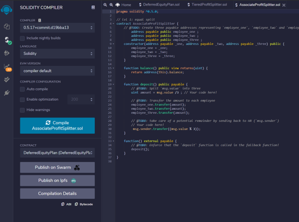

---
Account Entry
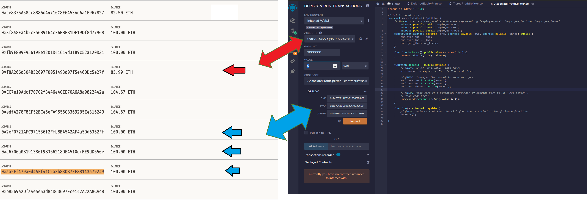

---

Contract Deployed

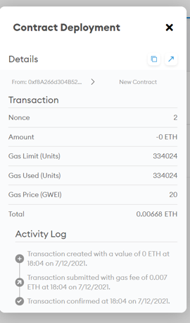

---

Distribute Funds

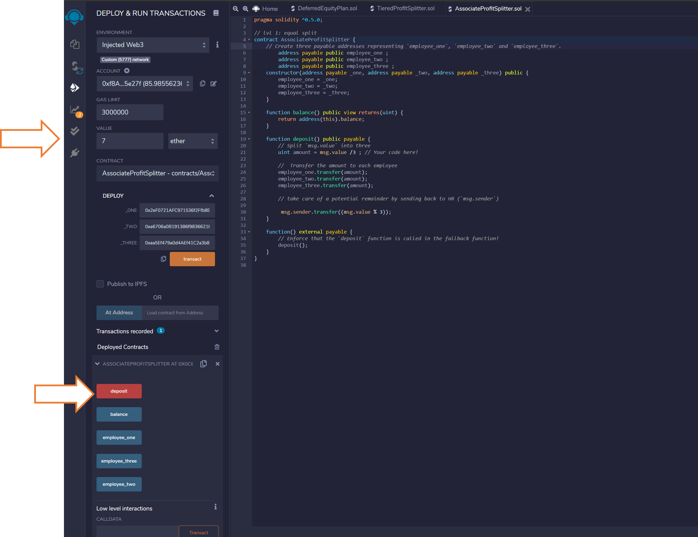

---

Confirm Transaction

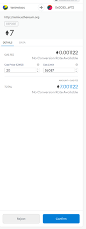

---

Transaction Details in Metamask

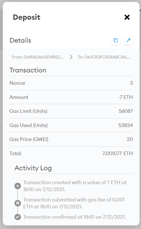

---

Balance verification in Ganache 

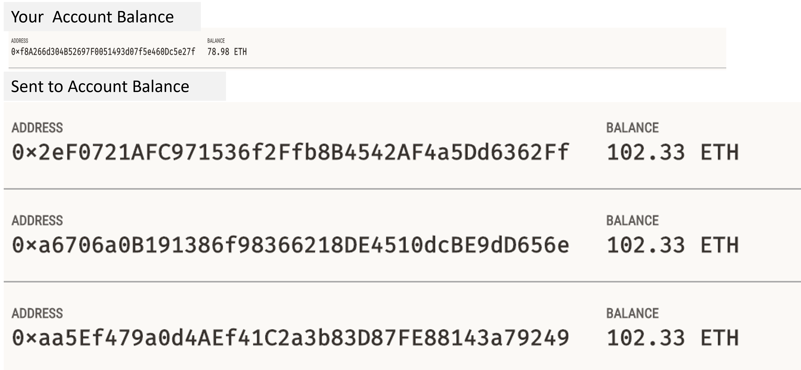

---

Transaction Details in Ganache 

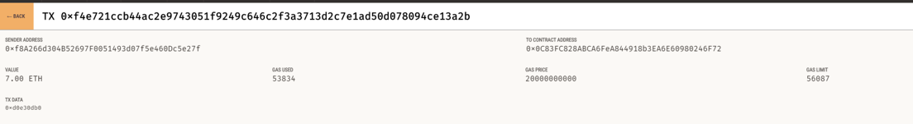

##  Distribute profits to different tiers of employees.
This contact is a `TieredProfitSplitter` contract  that will distribute different percentages of incoming ether to employees at different tiers/levels. For example, the CEO gets paid 60%, CTO 25%, and Bob gets 15%.

To execute this:
 1. Open the contract in remix ide:
 2. Compile the contract:
    * Enter the three public addresses of the each of the three employees in the deploy fields 
    * Click on transact 
    * Approve Metamask transaction
   
 3. Enter the amount you want to send in the value field 
 4. Click the red deposit button
 5. Approve the transaction and validate in Metamas.
 6. Review the balances in Ganache 
 7. Validate the transaction in Ganache

### Screenshots
---
Compile 

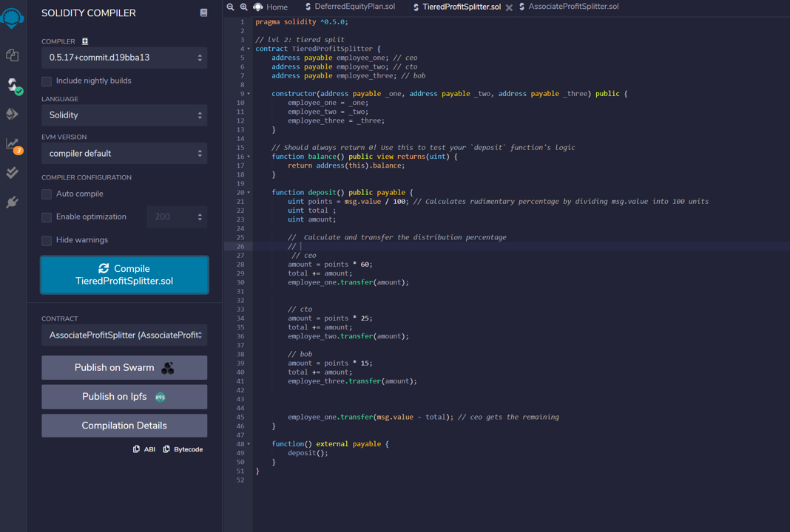

---

Account Entry

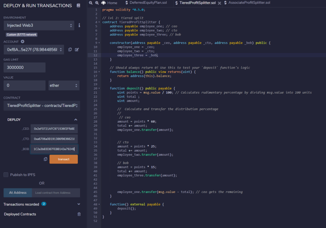

---

Contract Deployed

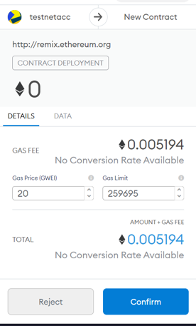

---

Distribute Funds

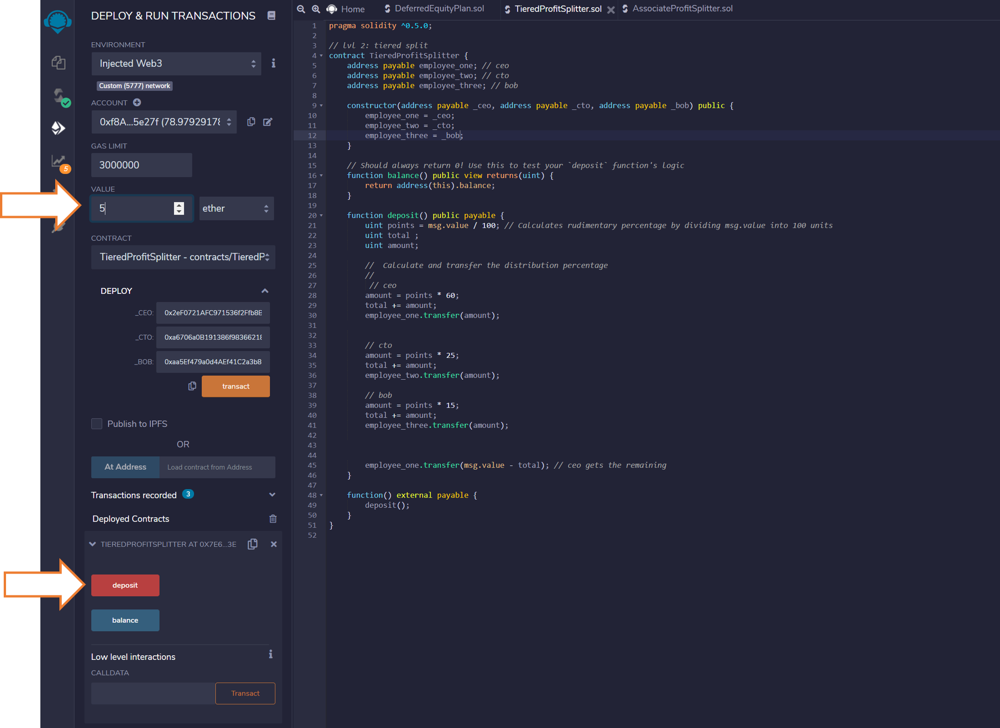

---

Confirm Transaction

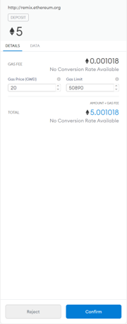

---

Transaction Details in Metamask

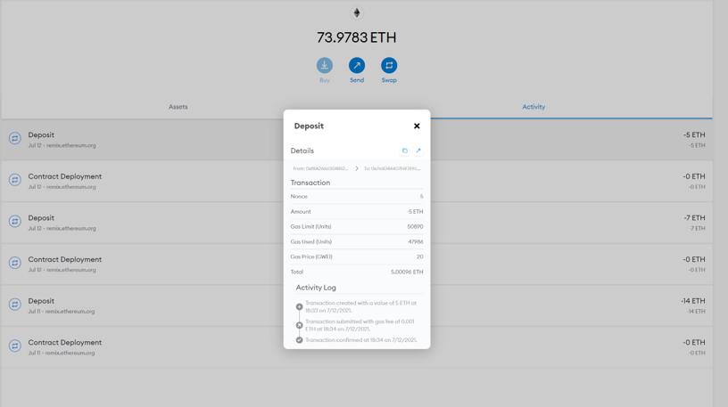

---

Balance verification in Ganache 

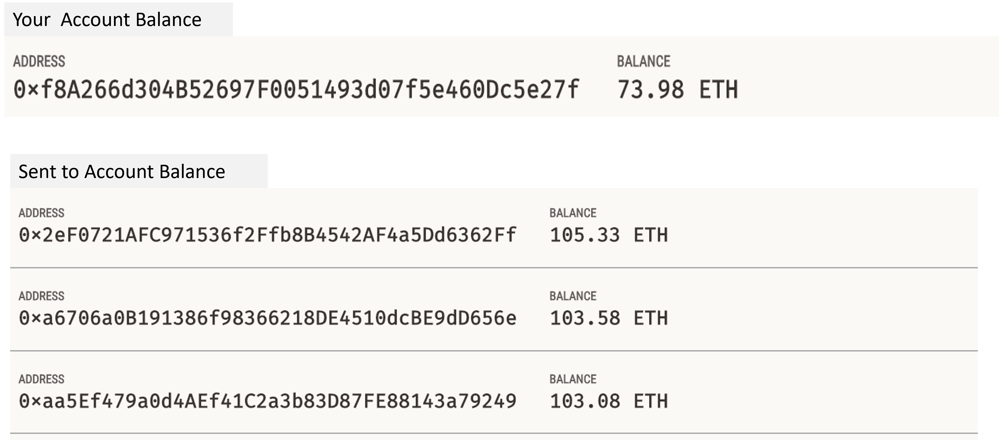

---

Transaction Details in Ganache 

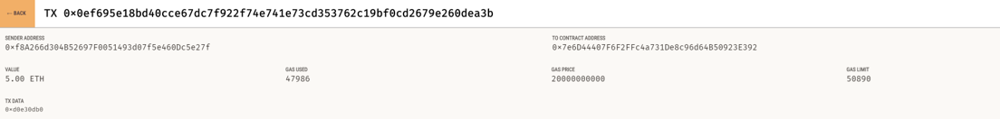

##  Distribute company shares for employees in a "deferred equity incentive plan" automatically

This contact is a is a `DeferredEquityPlan` that models traditional company stock plans. This contract will automatically manage 1000 shares, with an annual distribution of 250 shares over four years for a single employee.

To test first load [`DeferredEquityPlanTest`](contracts/DeferredEquityPlanTest.sol) :

To execute this:
 1. Open the contract in remix ide:
 2. Compile the contract:
    * Enter the  public addresses of the employee 
    * Click on transact 
    * Approve Metamask transaction
   
 3. Click the fast forward 4 times and approve the transaction in metamask so as to simulate 400 days.
 4. Click the distribute button to distribute the shares
 5. Check the unlock_time as well as distributed_shares by clicking on the buttons.

### Screenshots
---
Compile 

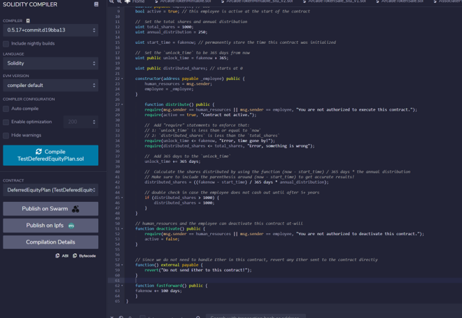

---

Account Entry and Deploy

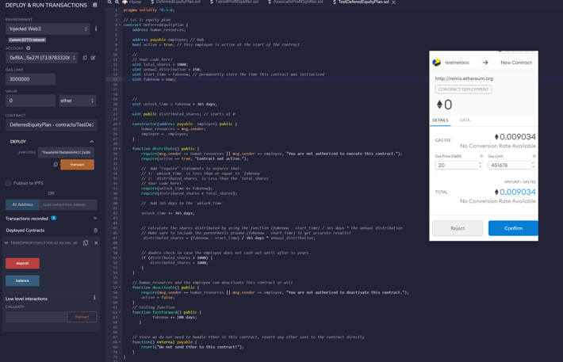

---

Contract Deployed

---

---

Test Contract

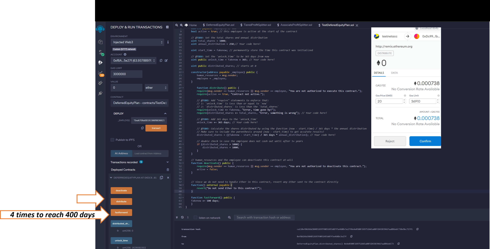

---

Review Shares Distributed

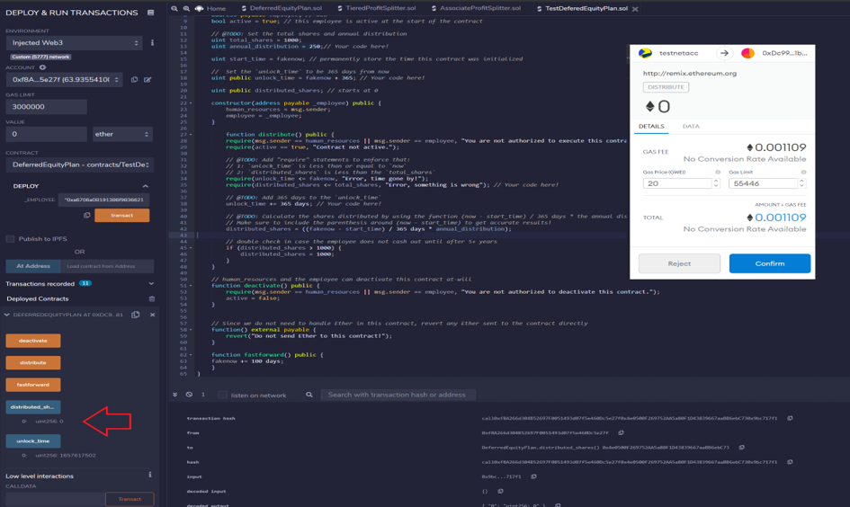

---

##  Deploy on an Ethereum Testnet 

This guide is for the Rinkeby Testnet - [`Rinkeby`](https://www.rinkeby.io/#faucet) - as it was the only providing test ether at the time of development. 
Switch MetaMask to Rinkeby, deploy the contracts as before, and copy/keep a note of their deployed addresses.
The transactions will also be in your MetaMask history, and on the public blockchain at [EtherScan](https://rinkeby.etherscan.io/).

### Screenshots
---
Account Entry and Deploy 

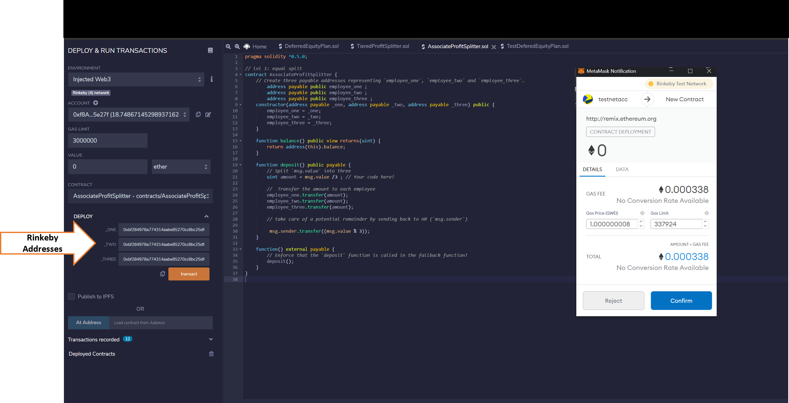

Contract Deployed

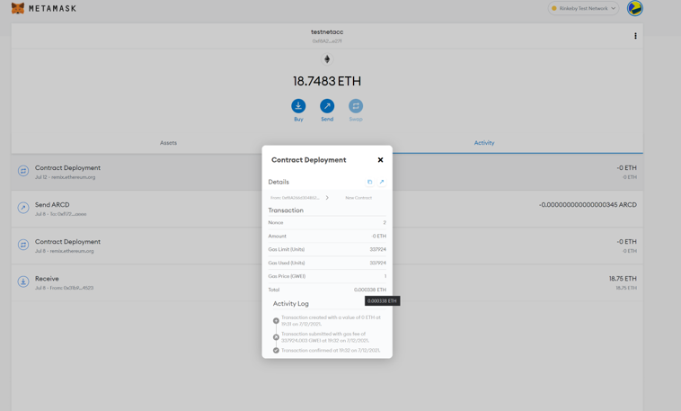

---

Distribute Funds

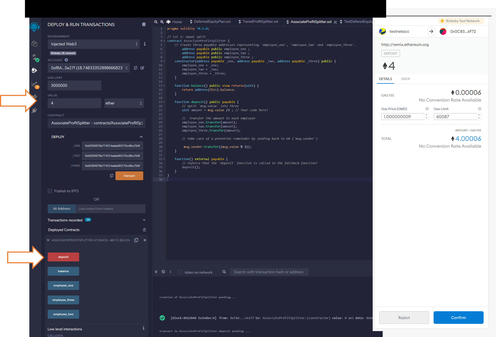

---

Await transaction confirmation in Metamask

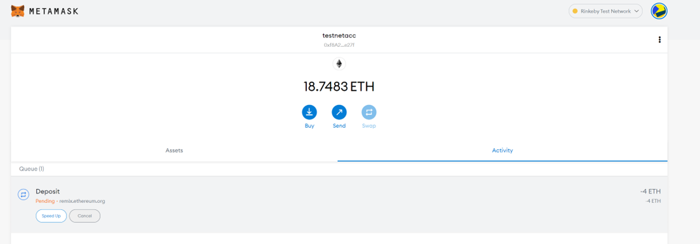

---

Transaction Confirmation

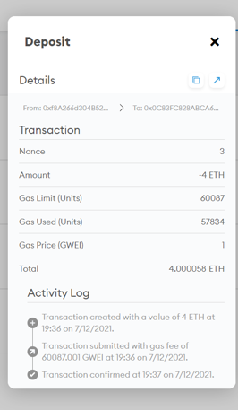

---

---

Public Blockchain Details Confirmation

---